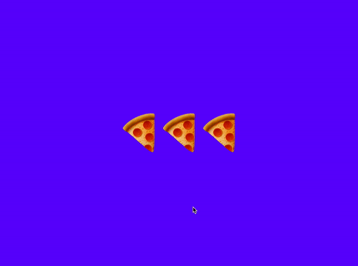

# **Phantom**

[](https://badge.fury.io/js/%40sidiousvic%2Fphantom) 
[](https://packagephobia.com/result?p=%40sidiousvic%2Fphantom)

### A Redux powered, state—reactive DOM rendering engine. 👻

### `npm i @sidiousvic/phantom`


#### Phantom lets you build state—reactive UIs using raw HTML in functional components.

```js
export default function Pizza(slices) {
  return `
    <div id="pizza-box">
      <h1 data-phantom="${slices}" id="slices-h1">${slices}</h1>
    </div>
  `;
}
```

#### You update data via Redux, and Phantom swaps DOM nodes for you.

<br>

### 🚀 [Get launched](#get-launched)

### 🍕 [Manage state](#manage-state)

### ❓ [FAQ](#faq)

### 🔧 [Developers](#developers)

### 👻 [Examples](#examples)

<br>

# 🚀 <a name="get-launched">Get launched</a>

### 1. Create a Redux Store

Phantom will couple with **Redux** to subscribe DOM rendering to state updates.

#### Install [Redux](https://redux.js.org/introduction/getting-started) &nbsp;`npm i redux`

<details>
<summary><b>Show code ↯</b></summary>

```js
import { createStore } from "redux";

const data = {
  slices: ["🍕", "🍕", "🍕"],
};

function reducer(state = data, action) {
  switch (action.type) {
    case "EAT_SLICE":
      // remove a slice from array
      return { ...state, slices: state.slices.slice(0, -1) };
    default:
      return state;
  }
}

const store = createStore(reducer);

export default reduxStore;
```

</details>

### 2. Write an entry Phantom component

Phantom components are functions that return HTML template strings. This allows you to inject dynamic data (including other components) via template literals `${}`.

We [`leet-html`](https://marketplace.visualstudio.com/items?itemName=EldarGerfanov.leet-html) extension for VSCode is recommended for HTML template highlighting.

<details>
<summary><b>Show code ↯</b></summary>

```js
function phantomComponent() {
  return `
    ${Pizza()} // inject the Pizza component from above
  `;
}
```

</details>

### 3. Initialize and `phantom.launch()`

Start the Phantom engine with the `reduxStore` and a `phantomElement`.

<details>
<summary><b>Show code ↯</b></summary>

```js
import phantom from "@sidiousvic/phantom";
import reduxStore from "./reduxStore.js";
import Pizza from "./ui/Pizza.js";

export const { fire, data, launch } = phantom(reduxStore, phantomComponent);

launch(); // initial render
```

Phantom will expose three key methods: `fire`, `data`, and `launch`.

`fire` and `data` are only syntactic pointers to the `reduxStore`'s `dispatch` and `getState` methods respectively. **You are welcome to avoid them and call the store directly for action dispatching and state getting.**

`launch` will perform the initial DOM render on call.

</details>

<br>

# 🍕 <a name="manage-state">Manage state</a>

### Use `data()` to read state from the Redux store.

```js
function phantomComponent() {
  const { slices } = data();
  return `
    ${Pizza(slices)}
  `;
}
```

### Pass data as arguments to components, and use them in your HTML templating.

```js
export default function Pizza(slices) {
  return `
    <div id="pizza-box">
      <h1 data-phantom="${slices}" id="slices-h1">${slices}</h1>
    </div>
  `;
}
```

| ⚠️ &nbsp; Always bind _stateful_ elements with the `data-phantom` attribute. |
| :--------------------------------------------------------------------------- |


<br>

| ⚠️ &nbsp; Specify an id attribute for _all_ elements. |
| :---------------------------------------------------- |


### Use `fire()` to fire an action and trigger a state update + re—render.

```js
document.addEventListener("click", eatPizza);

function eatPizza(e) {
  if (e.target.id === "slices-h1") {
    fire({ type: "EAT_PIZZA" }); // fire an action to the store
  }
}
```

<br>

# ❓ <a name="faq">FAQ</a>

### Why use Phantom ?

#### A baby panda dies every time you choose a 1MB+\* industrial—level frontend framework to code a pomodoro or a personal portfolio page. 🐼

<details>
<summary><b>Show rationale ↯</b></summary>

#### You don't drive to the corner store, but walking is overrated. Phantom is the bike you need.

#### 🖍 Declarative

With Phantom, you can write markup in a declarative way ala JSX using raw HTML strings, and inject dynamic data using template literals—staying fully JS native.

#### 🍕 Component—based

Phantom lets you divide your UI into components, abstracting markup into composable functions.

#### 🧪 Reactive

The Phantom engine integrates with your Redux store and subscribes to state updates. It swaps nodes when their data changes.

#### 👩🏾‍🏭 Closer to the JS _metal_

Phantom only helps with DOM rendering. Listeners, effects, style manipulation, routing—the _fun_ stuff—is still in your hands. 🙌🏼

No JSX, no complex API, no syntactic hyperglycemia.

<sub>\* unpacked size of ReactDOM is 3MB. Vue is 2.98MB. **Phantom is < 99 kB.**</sub>

</details>

### Does Phantom use a virtual DOM?

<details>
<summary><b>Show answer ↯</b></summary>

When a component's data changes, Phantom will re—render that node in the DOM by diffing its internal **PseudoDOM**, an object representation of the DOM.

</details>

### Why should I always include the `data-phantom` attribute in stateful elements?

<details>
<summary><b>Show answer ↯</b></summary>

In order for your element to be reactive to data changes, Phantom needs to know which nodes are bound to the updated data. Specifying a `data-phantom="${yourData}"` attribute is a simple way to do that.

</details>

### Why should I always include an `id` attribute in stateful elements?

<details>
<summary><b>Show answer ↯</b></summary>

Two reasons, one philosophical, one technical:

**I.** Once you get into the habit, specifying `id`s results in remarkably declarative markup. It encourages you to think about each element's specific function in the UI and also helps to identify it visually.

**II.** `id` is one of the mechanisms that the Phantom engine uses to detect which nodes to update.

</details>

<br>

# 🔧 <a name="developers">Developers</a>

Phantom is written in TypeScript and bundled using Webpack.

## Instructions

0.  **Read** the [Code of Conduct](./CODEOFCONDUCT.md)
1.  **Fork** the repo on GitHub
2.  **Clone** the project to your machine
3.  **Install** dependencies with `npm i`
4.  **Commit** updates to your own branch
5.  **Push** your work to your fork
6.  **Pull request** for your changes to be reviewed

## Scripts

**`npm run build`**
generates a static build in `dist/` .

**`npm run test`**
runs the tests located in `__tests__/`.

**`npm run example/[example name]`**
runs an example app from `examples/` via `webpack-dev-server`.

### If you find a 🐞, please **[file an issue](https://github.com/sidiousvic/phantom/issues)**.

<br>

# 👻 <a name="examples">Examples</a>

There are several [examples](./examples) you can run, each furnished with their own `devServer` configuration.

<a href="https://codesandbox.io/s/phantompizza-668sj" target="_blank"></a> <a href="https://codesandbox.io/s/phantomtodo-n1mfq" target="_blank"></a> <a href="https://codesandbox.io/s/phantomcalculator-fifgn" target="_blank"></a>

### Phantom in [CodeSandbox](https://codesandbox.io/s/phantomcalculator-fifgn)

Click on one of the images above to be taken to an online sandbox.

Devs who have cloned Phantom may use **`npm run example/[example name]`** and navigate to the url that appears in their terminal.

<br>

###  Phantom is made with love and pepperoni by [@sidiousvic](https://www.github.com/sidiousvic)
